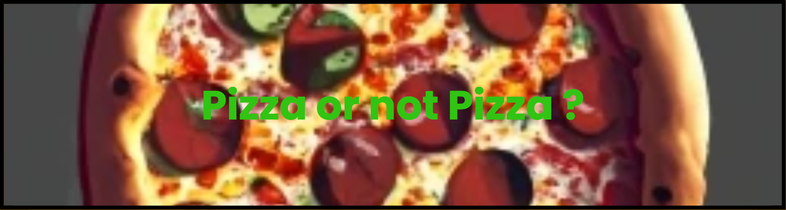

<p align="center"></p>

Pizza Or Not Pizza?  
===================
[](https://github.com/Hugosh71/Pizza-or-not-Pizza-/actions/workflows/editorconfig-checker.yml)

Un simple classifieur d'images déterminant si une image est une pizza (ou pas ?).

Structure du projet
---------
le répertoire contient les modules suivant :

- *Index.js* : ce fichier contient le code principal en JS, permettant de charger les images pré-entrainées et de prédire si l'image affichée a la caméra sera une pizza ou pas.

- *Index.html*: ce fichier contient l'interface de la page HTML, il appelle le script *Index.js*, les modèles nécessaires à la prediction (knn,tfjs et mobilenet) et contient l'id des boutons Add pizza et Add food, permettant d'ajouter une image au dataset correct au cas ou celle-ci serait mal reconnu par le programme.

- *Rename.py*: ce fichier Python contient une fonction permettant de renommer les fichier d'un dataset en ajoutant a chaque image un numéro qui s'incrémente.

- *pizza_not_pizza*: ce dossier contient les dataset complet utilisé pour notre projet, un sous dossier pizza comportant les images de pizzas et un sous dossier not_pizza comportant les images de non-pizzas.

- *pizza_full*: ce dossier contient toutes les images de pizzas du dataset après modifications par le fichier *rename.py*.

- *not_pizza_full*: ce dossier contient toutes les images de non-pizzas du dataset après modifications par le fichier *rename.py*.

Dataset  
--------
Nous avons utilisés un dataset via Kaggle pour notre projet, ce dataset contient 983 images de pizzas et 983 images d'autres plats.
[Dataset's Web site](https://www.kaggle.com/datasets/carlosrunner/pizza-not-pizza)  


## GitHub Action 
--------
- *editorconfig-checker*: Télécharge un clone du repo, installe l'outil editorconfig-checker, vérifie si le style du code respecte l'editorconfig du repo.(pour l'instant désactivé)


## Editor config utilisé
```
# EditorConfig is awesome: https://EditorConfig.org

# top-most EditorConfig file
root = true

# Unix-style newlines with a newline ending every file
[*]
end_of_line = lf
insert_final_newline = true
charset = utf-8
```
## Lancer le code (VSCode)
--------
- Telechargez le repo via le bouton "Code", puis extrayez les fichiers
- Ouvrez le projet sur VSCode
- Installez l'extension "Live Server" de Ritwick Dey
- Une fois l'extension installée et VSCode redémarré, vous devriez voir un bouton "Go Live"
- Cliquez sur le bouton Go Live avec le dossier du projet ouvert
- Vous devriez maintenant avoir l'interface HTML du projet ouvert, attendez environ 20 secondes que la base de données charge.
- Une fois la base de données chargée, votre webcam s'allumera et vous pourrez tester le classifieur en montrant à la caméra une image de pizza (ou pas !)
